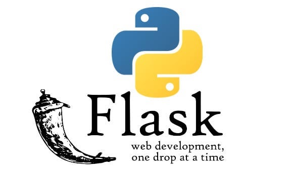

# Flask-Python Backend



## Structure

The backend Flask server links all the machine learning (ML) modules together. After receiving a POST request from the frontend, the backend will run the text through the respective ML modules and return the output to the frontend.

The Flask server receives POST requests using Flask's `request` module and makes POST requests using an external `requests` library.

`backend/app.py`

The general purpose of the functions shown below is to take a text string as an input, and make an api call to their respective NLP module stored either as a running docker image locally, or on the openshift platform. 

```python

'''For the sake of brevity, we will only show the code for the first function. The other functions follow a similar structure'''

# Sentiment
def postSentimentRequest(text):
    # If using Openshift
    url = "http://sentiment-alice.apps.8d5714affbde4fa6828a.southeastasia.azmosa.io/sentiment"
    # If running locally using Docker Compose
    url = 'http://sentiment:5050/sentiment'
    requestJson = {"text": text}
    result = requests.post(url, json=requestJson)
    return result.json()

# Summary
def postSummaryRequest(text, no_of_sentence):

# NER
def postNerRequest(text):

# Relation
def postRelationRequest(ner):

# Topic Modelling
def postTopicRequest(text, no_topic, no_top_words):

# Text Classifier
def postClassifierRequest(text):

# Wordcloud
def postWordCloud(text):

# Document Clustering
def postCluster(corpus):

#Aspect Based Sentiment Analysis (ABSA)
def postABSA(data):

```

All of the NLP functions shown above are called by a helper function, `runAlice()`. The purpose of `runAlice()` is to take a text string as an input, run the various NLP functions, consolidate and store the different results in a python `Dictionary` and finally return it. 


``` python
def runAlice(text):

''' For the sake fo brevity, we will only show the code for the first 3 NLP modules. The other NLP modules are called in a similar fashion'''

    # Topic Modelling
    print("Sending topic")
    topicJson = postTopicRequest([text], 1, 10)
    topics = topicJson['topics']
    print("receive topic")

    # Sentiment
    sentimentJson = postSentimentRequest(text)
    sentimentList = sentimentJson["sentiment"]
    key_data_sentiment = sentimentList[0]["sentiment"]
    key_data_legitimacy = sentimentList[1]["sentiment"]
    sentimentList[0]["sentiment"] = "sentiment"
    sentimentList[1]["sentiment"] = "subjective"

    # Classifier
    print("sending classifier")
    classifyJson = postClassifierRequest(text)
    classify = classifyJson['classify']
    print("receive classifier")

    .
    .
    .

    jsonToReact = {}
    jsonToReact["keyData"] = keyData
    jsonToReact['sentiment'] = sentimentList
    jsonToReact['summary'] = summary
    jsonToReact['topics'] = topics
    jsonToReact['classify'] = classify
    jsonToReact['ner'] = ner
    jsonToReact['relation'] = relation
    jsonToReact['network'] = network
    jsonToReact['wordcloud'] = wordcloud
    return jsonToReact
```

Apart for `runAlice()`, there is another helper function called `getOverview()`. This function is called when the user uploads more than one document. It serves to combine the results of the individual documents to provide an overview.

``` python
def getOverview(corpus, corpusEntity, corpusRelation, absaDocument, sentimentWordDocument, fileNames):

''' For the sake fo brevity, we will only show the code for the first 3 NLP modules. The other NLP modules results are combined in a similar fashion.

i.e. by combining the results of the individual documents (see NER) 
                    OR 
by making another api call to the NLP module (see Cluster). '''

    # Cluster
    print("sending cluster", flush=True)
    sendJson = {"corpus": corpus, "fileNames": fileNames}
    clusterJson = postCluster(sendJson)
    cluster = clusterJson['clusterData']
    print('receive cluster')

    # NER
    print("Send to NER")
    ner = list(corpusEntity.values())
    for entity in ner:
        entity['documents'] = list(entity['documents'])
    print("Receive from NER")

    # Network
    print("start relation network")
    network = overviewRelationToNetwork(corpusRelation, corpusEntity)
    print("finished relation network")

    .
    .
    .

```

## Routes

`@app.route("/")` is a Python decorator that Flask provides to assign URLs in our app to functions easily. The decorator executes a function whenever a user visits the domain at the given .route(<route_name>).

E.g. The function `loadExistingFile()` is executed whenever the route `/loadExistingFile` is accessed.

```python
@app.route("/loadExistingFile", methods=["POST"])
def loadExistingFile():
    ...
```

### /loadDbFile

The path accessed when the user inputs a MongoDB ObjectID.

```python
@app.route("/loadDbFile", methods=["POST"])
def dbRetrieval():
    try:
        ...

        data = mongo.db.Documents.find_one({"_id": objectID}) # Access MongoDB and retrieve the document based on the ObjectID
        ...
    except Exception as err:
        print(f"Error retrieving data from database: {err}", flush=True)
        returnJson = {"Error": err}
    return returnJson
```

### /loadExistingFile

The path accessed when the user inputs an existing .json file.

```python
@app.route("/loadExistingFile", methods=["POST"])
def loadExistingFile():
    file = request.files['existingFile']
    jsonData = json.loads(file.read())
    return jsonData
```

### /updateNetwork

The path accessed when the relation data is updated and sent to the backend. The corresponding updated network data is generated and returned to the frontend.

```python
@app.route("/updateNetwork", methods=['POST'])
def updateNetwork():
    relationData = json.loads(request.form['relationData'])
    networkData = relationToNetwork(relationData)
    return json.JSONEncoder().encode(networkData)
```

### /uploadFile
This path is accessed when the user uploads new `txt` or `pdf` documents for ALICE to process. The corresponding `receiveFile()` function will extract the raw text from the documents and pass it to the `runAlice()` function to obtain the NLP results. 

If there is more than one file that was uploaded, the `receiveFile()` function will process these documents sequentially in a `For` loop. The `getOverview()` function will also be called to generate the results for the overview dashboard.

The code snippet below shows the general outline of how the `receiveFile()` function is intended to work. The actual working function involves more preprocessing of data and post-processing of results.

``` python
def receiveFile():
    print("Receiving File", flush=True)
    length = int(request.form['length'])
    fileNames = json.loads(request.form['fileNames'])
    for i in range(length):
        file = request.files[f'file{i}']

        # Get filename
        fileName = fileNames[i]

        # Get file extension
        name, extension = os.path.splitext(fileName)
        print('POST SUCCESSFUL', fileName, flush=True)
        if extension == '.txt':
            byteString = file.read()
            encoding = chardet.detect(byteString)['encoding']
            text = byteString.decode(encoding)
        elif extension == '.pdf':
            text = ''
            with pdfplumber.load(file) as pdf:
                for page in pdf.pages:
                    text += page.extract_text()
        text = re.sub('\\\\', '', text)
        tempJson = runAlice(text)
        return tempJson
```


### /saveToDb
This route is accessed when a user wants to save the output to MongoDB. Note that this is not recommended as we are currently using a free version of MongoDB which has limited storage and it is easy to exceed the storage limits. 

However, we are keeping this route and function here in the event that we do upgarde and get more storage on MongoDB.

``` python
@app.route("/saveToDb", methods=["GET", "POST"])
def saveToDb():
    data = request.get_json()
    res = mongo.db.Documents.insert_one(data)
    res_id = str(res.inserted_id)
    print(res_id)
    return res_id
```

### User Authentication

This section covers the `/login` and `/create` routes used for login and creation of account respectively. The user authentication feature is working but not currently in used in the ALICE system due to lack of requirements. However, we decided to keep the codes here in the event that the need do arise.

The user authentication feature uses Json Web Tokens (JWT) and an extremely weak secret key. In the event that the user authentication feature needs to be implemented, the secret key should be changed to something much stronger. 

``` python
@app.route("/login", methods=["POST"])
def login():
    data = request.json
    username = data["username"]
    password = data["password"]
    userData = (mongo.db.Authentication.find_one({"Username": username}))
    if (userData != None):
        if (password == userData["Password"]):
            role = userData["Role"]
            token = jwt.encode({"user": username,
                                "exp": datetime.datetime.now() + datetime.timedelta(hours=3)},
                               app.config['SECRET_KEY'], algorithm="HS256")
            return jsonify({"token": token.decode('UTF-8'), "validity": "valid", "Role": role})
    return jsonify({"validity": "invalid"})


@app.route("/create", methods=["POST"])
def createAcc():
    data = request.json
    try:
        creatorToken = data["creator"]
        if(authenticateUser(creatorToken) == False):
            return "invalid"
        userName = data['username']
        password = data['password']
        role = data['role']
        exist = findUser(userName)
        if (exist == True):
            return "exist"
        else:
            accountJson = {'Username': userName, 'Password': password, 'Role': role}
            result = mongo.db.Authentication.insert_one(accountJson)
            print(result)
            return "success"
    except:
        return "error"
```


## Parallel Branch (Threading)
As mentioned above, the `receiveFile()` function runs through each document sequentially if there is more than one document that was uploaded. This is not efficient and does not utilise the auto scaling when running on the openshift platform. 

Thus, we modified the `receiveFile()` function to include threading which allows all the documents to be run in parallel on the openshift platform. The threading together with the auto-scaling, can significantly reduce the processing time, especially when many documents are uploaded.

Do take note that the `parallel` branch should only be used on the openshift platform. If you are running ALICE locally, do use the `local` branch instead.

### Implementation

To help us perform the threading, we will be introducing one new class and one new function into `backend/app.py`.

The new class is meant to be a data class to consolidate the results from different threads. To ensure that we do not run into any race condition, we also initialise locks within the data class to achieve mutual exclusivity. 


``` python
class dataClass():
    def __init__(self):
        self.returnJsonLock = threading.Lock()
        self.returnJson = {}
        self.corpusEntity = {}
        self.corpusEntityLock = threading.Lock()
        self.corpusRelation = []
        self.corpusRelationLock = threading.Lock()
        self.absaDocument = {}
        self.absaDocumentLock = threading.Lock()
        self.sentimentWordDocument = {}
        self.sentimentWordDocumentLock = threading.Lock()
        self.users = 0
```
The new function defines the task that each thread is suppose to perform. We are not adding any new features here, but just transferring some of the code from the old `receiveFile()` function to the thread task function.

``` python
def thread_task(text, fileName, number, data):
    print(f"Thread {number} running", flush=True)
    try:
        tempJson = runAlice(text)
        newRelation = tempJson['relation'].copy()
        absaChapter = tempJson['sentiment'][2]['absaChapter'].copy()
        sentimentWordChapter = tempJson['sentiment'][2]['sentimentWordChapter'].copy()
        # Lock
        data.sentimentWordDocumentLock.acquire()
        entity_sentimentwords_document(data, sentimentWordChapter)
        data.sentimentWordDocumentLock.release()
        # Lock
        data.absaDocumentLock.acquire()
        absa_document_combined_c(data, absaChapter, fileName)
        data.absaDocumentLock.release()
        # Lock
        data.returnJsonLock.acquire()
        data.returnJson[fileName] = tempJson
        data.returnJsonLock.release()
        # Lock 
        tempEntity = tempJson['ner']['ents']
        for entity in tempEntity:
            key = entity['text']+'_'+entity['type']
            data.corpusEntityLock.acquire()
            if key in data.corpusEntity:
                data.corpusEntity[key]['value'] += 1
                data.corpusEntity[key]['documents'].add(fileName)
            else:
                data.corpusEntity[key] = {
                    'id': entity['text'],
                    'label': entity['text'],
                    'value': 1,
                    'documents': set([fileName]),
                    'type': entity['type'],
                    'color': nercolors[entity['type']]
                }
            data.corpusEntityLock.release()

        for relation in newRelation:
            relation['documents'] = [fileName]
            # Semaphore this
            data.corpusRelationLock.acquire()
            data.corpusRelation.append(relation)
            data.corpusRelationLock.release()
        print(f"Thread {number} finish", flush=True)

    except Exception as err:
        print(err, "occured in "+fileName + " in thread " + str(number), flush=True)
    except:
        print('Unknown error in'+fileName, flush=True)
```

The `receiveFile()` function has to be modified to implement the threading as well. 

Do take note that we have to initialise a new DataClass instance  whenever the `/uploadFile` route is accessed. This ensures that the data of each upload session is stored in different memory locations and does not interfere or affect each other in any way.

``` python
@app.route("/uploadFile", methods=["GET", "POST"])
def receiveFile():
    data = dataClass()
    print(f"New file, creating new dataclass. Data: {data.corpusEntity}", flush=True)
    print("Receiving File", flush=True)
    length = int(request.form['length'])
    fileNames = json.loads(request.form['fileNames'])
    corpus = []
    threads = []
    for i in range(length):
        file = request.files[f'file{i}']

        # Get filename
        fileName = fileNames[i]

        # Get file extension
        name, extension = os.path.splitext(fileName)
        print('POST SUCCESSFUL', fileName, flush=True)
        if extension == '.txt':
            byteString = file.read()
            encoding = chardet.detect(byteString)['encoding']
            text = byteString.decode(encoding)
        elif extension == '.pdf':
            text = ''
            with pdfplumber.load(file) as pdf:
                for page in pdf.pages:
                    text += page.extract_text()
        text = re.sub('\\\\', '', text)
        corpus.append(text)
        thread = threading.Thread(target=thread_task, args=(text, name, i, data))
        thread.start()
        threads.append(thread)

    for thread in threads:
        try:
            thread.join()
        except Exception as err:
            print("Error in joining: " + err, flush=True)
    print("All threads finished", flush=True)

    try:
        if length > 1:
            data.returnJson['Overview'] = getOverview(corpus, data.corpusEntity, data.corpusRelation, data.absaDocument, data.sentimentWordDocument, fileNames)
        returnDict = data.returnJson
        returnJson = jsonify(returnDict)
    except Exception as err:
        print(f"Error in completing overview: {err}", flush=True)

    return returnJson
```