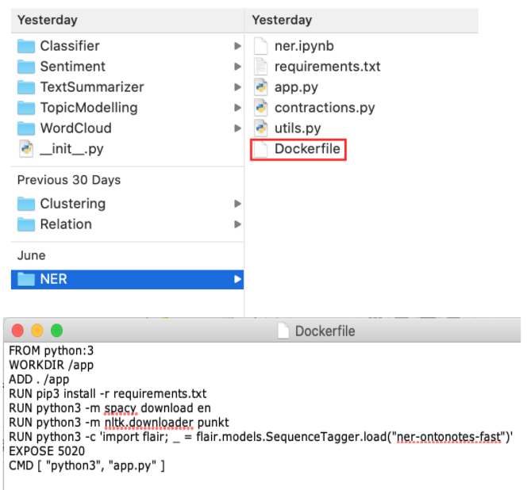
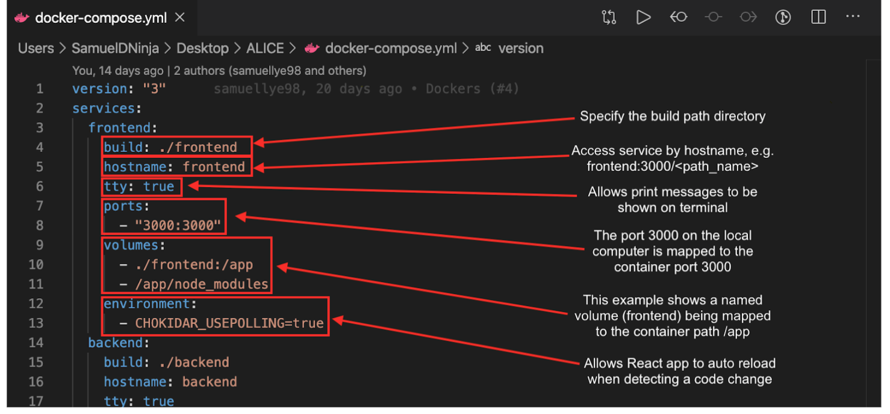
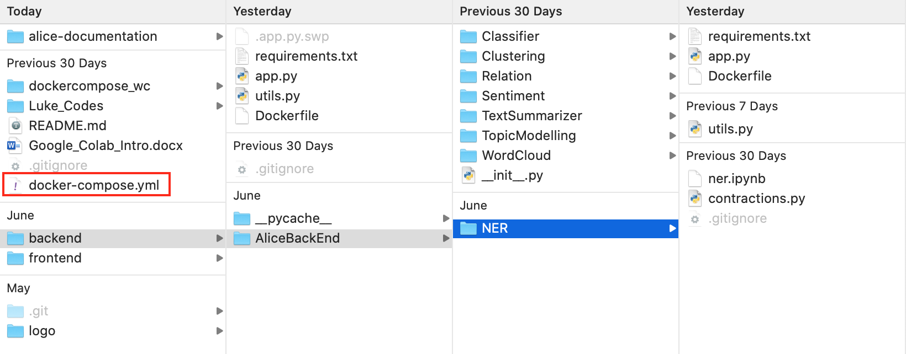

# Docker


- Docker is an open platform for developing, shipping, and running applications. Due to using a variety of ML modules which require different Python modules, we adopted the use of Docker containers to create isolated file systems for our ML modules.

  - A Docker image is a file, comprised of multiple layers, that is used to execute code in a Docker container. An image is essentially built from the instructions for a complete and executable version of an application, which relies on the host OS kernel. A Docker container is a runnable instance of an image.
  - Containers are lightweight because they don’t need the extra load of a hypervisor, but run directly within the host machine’s kernel.


- A.L.I.C.E. is comprised of the following Docker containers: Summarizer, Classifier, Sentiment, Topics, Wordcloud, NER, Relation Extraction, Clustering, Backend Flask server, and our Frontend React and Node server.

- For future plans, we aim to utilize Red Hat’s Openshift platform that is powered by Kubernetes. Kubernetes provides the ability to run containers on various machines, auto-scale containers, distribute load between containers, manage storage required by containers, and provide resiliency of containers in case of failure. Kubernetes helps simplify container runtime by managing Docker-based applications that are placed on an underlying assures system that maintains several replicas of running applications. Kubernetes has enabled developers to accelerate the development of cloud-native applications and created an ecosystem of services that are self-driven and reusable.

## DockerFile

A `Dockerfile` is a text document that contains all the commands a user could call on the command line to assemble an image.

The structure of the `DockerFile` is shown below. More details can be found [here](https://docs.docker.com/engine/reference/builder/).



To build a Docker image from a `DockerFile` and run the Docker image as a container:

```bash
cd NER // root directory of the DockerFile
run docker build .
run docker run [docker_image] -p 5080:5080 // maps port 5080 of the localhost to the port of the container
```

## Docker Compose

[Docker Compose](https://docs.docker.com/compose/) is a tool for defining and running multi-container Docker applications.

Define a `docker-compose.yml` file and run `docker-compose up`. If images are not built, they will be built during the `docker-compose up` process.

A `docker-compose.yml` file looks like the following:


The file structure of the `docker-compose.yml` should be at the root directory:


To run the entire application:

```bash
// root directory
docker-compose build
docker-compose up

// to build certain images
docker-compose build <service_name>
```
