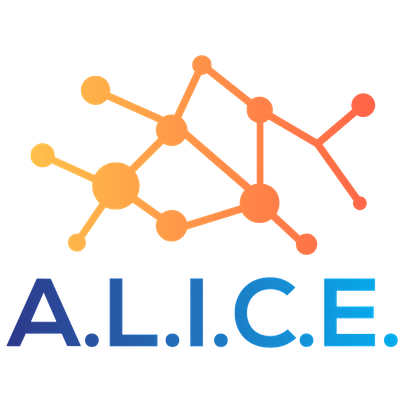
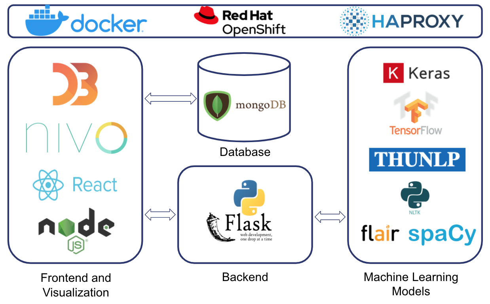

# A.L.I.C.E. Documentation

## About

Automatic text summarization methods are greatly needed to address the ever-growing amount of text data available online to both better help discover relevant information and to consume relevant information faster.
Analyzing Language Interface Created for Everyone (A.L.I.C.E.) is purposed to summarize text documents and output informative visualization displays that quickly and easily communicate the contents of the text to the user.
The key components of A.L.I.C.E. are the Frontend (React, D3), Backend (Flask, Machine Learning models), as well as DevOps (Docker, Openshift).

## Table of Contents

| Steps                                  | Frontend | Backend | DevOps |
| -------------------------------------- | :------: | :-----: | :----: |
| [React and Redux-Saga](./react.md)     |    ✅    |         |        |
| [Visualization](./visualization.md)    |    ✅    |         |        |
| [Backend Flask Server](./backend.md)   |          |   ✅    |        |
| [Document Clustering](./clustering.md) |          |   ✅    |        |
| [Named Entity Recognition](./ner.md)   |          |   ✅    |        |
| [Relation Extraction](./relation.md)   |          |   ✅    |        |
| [Sentiment Analysis](./sentiment.md)   |          |   ✅    |        |
| [Text Classifier](./classifier.md)     |          |   ✅    |        |
| [Text Summarizer](./summary.md)        |          |   ✅    |        |
| [Topic Modelling](./topics.md)         |          |   ✅    |        |
| [Wordcloud](./wordcloud.md)            |          |   ✅    |        |
| [Docker](./docker.md)                  |          |         |   ✅   |
| [Openshift](./openshift.md)            |          |         |   ✅   |

## Appendix

- [NER Appendix](./ner-appendix.md)
- [Relation Types](./relation-types.md)

## Resources

<!-- - 21/07/2020 - [Ops Presentation](./files/Ops_Presentation.pdf)
- 30/06/2020 - [Midterm Report](files/Midterm_Report.pdf)
- 26/05/2020 - [EP Presentation](files/EP_Presentation.pdf) -->

- 20/05/2020 - [Google Colab Tutorial](files/Google_Colab_Tutorial.pdf)

## Getting Help

If there is any issue that is not addressed in this document, kindly [create an issue on this Github repository](https://github.com/luketankw/ALICE/issues).
