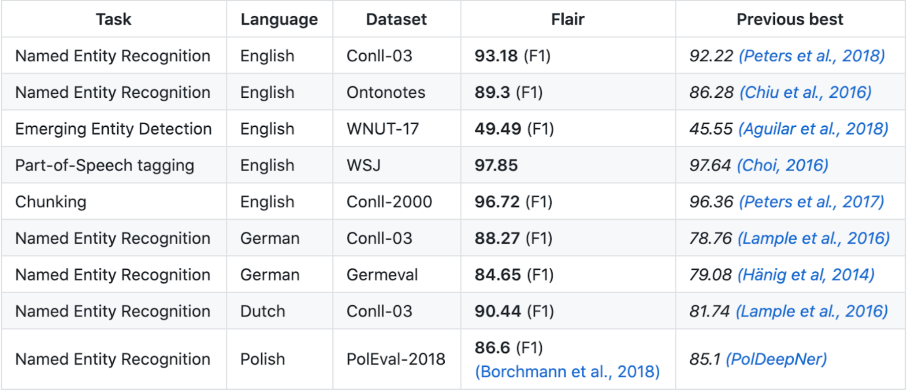

# Named Entity Recognition (NER)


- A named entity is a word or a phrase that clearly identifies one item from a set of other items that have similar attributes. Examples of named entities are organization, person, and location names in general domain; gene, protein, drug and disease names in biomedical domain. NER is the process of locating and classifying named entities in text into predefined entity categories.
- The main datasets that NER models are trained and evaluated upon are the CoNLL03 and OntoNotes5.0 datasets.
- There are 4 main streams of NER:

  1. Rule-based approaches, which do not need annotated data as they rely on hand-crafted rules;
  2. Unsupervised learning approaches, which rely on unsupervised algorithms without hand-labeled training examples;
  3. Feature-based supervised learning approaches, which rely on supervised learning algorithms with careful feature engineering;
  4. Deep-learning based approaches, which automatically discover representations needed for the classification and/or detection from raw input in an end-to end manner.

- A list of existing NER libraries and comparison of the performance of different NER models can be found in Appendix I.
  Therefore, we explored the use of deep-learning based approaches, such as BERT and Transformers. We decided to use Flair, which is a new framework for sequence labelling (NER and parts of speech tagging). By learning to predict the next character on the basis of previous characters, Flair is able to leverage the internal states of a trained character language model to produce a novel type of word embedding which its developers refer to as contextual string embeddings. These embeddings have the distinct properties that they (a) are trained without any explicit notion of words and thus fundamentally model words as sequences of characters, and (b) are contextualized by their surrounding text, meaning that the same word will have different embeddings depending on its contextual use. Flair achieved one of the higher performance (89.3%) on OntoNotes5.0 and the state-of the-art performance (93.18%) on CoNLL03.
  

- Some NER resources can be found [here](./ner-appendix.md)

## [FlairNLP](https://github.com/flairNLP/flair)

`backend/AliceBackEnd/NER/app.py`

```python
import nltk
from flair.data import Sentence
from flair.models import SequenceTagger

# load pre-trained NER model
tagger_fast = SequenceTagger.load('ner-ontonotes-fast')

def generateTextToNer(text):
    """
    Accepts a string and  returns a dictionary with the following keys:
    'ents' contains a list of entities, 'text' contains the entire text string, and 'passToRelation' contains a list of possible combinations of two entities in a sentence.
    """

    # Pre-processing of text
    clean_text = normalize_corpus([text], ...)
    ...

    # Final result
    res = {'ents': [], 'text': '', 'passToRelation': []}
    ...

    # split the entire text into sentences
    lst_sentences = nltk.sent_tokenize(text)
    ...
    for s in lst_sentences:
        # Create a sentence object
        sentence = Sentence(s, useTokenizer=True)

        # run NER over sentence
        tagger_fast.predict(sentence)
        dict_flair = sentence.to_dict(tag_type='ner')

        # Track how many times a particular entity appears throughout the text and assigns it a unique id
        for idx in dict_flair['entities']:
            ...

        ...
        # Finds all possible combinations of two entities in a sentence
        combination = combine(dict_flair)
        res['passToRelation'].extend(combination)

    ...
    return res

```

The result that Flair generates from `dict_flair = sentence.to_dict(tag_type='ner')` is in the form:

```python
{'text': 'George Washington went to Washington .',
    'entities': [
        {'text': 'George Washington', 'start_pos': 0, 'end_pos': 17, 'type': 'PER', 'confidence': 0.999},
        {'text': 'Washington', 'start_pos': 26, 'end_pos': 36, 'type': 'LOC', 'confidence': 0.998}
    ]}
```

The final result returned from our module is in the form:

```python
{
  'text': 'George Washington went to Washington.',
  'ents': [
     {
        "end": 17,
        "id": 0,
        "start": 0,
        "text": "George Washington",
        "type": "PER"
      },
      ...
  ],
  'passToRelation': [
      {
        "e1": "George Washington",
        "e1_id": 0,
        "e1_label": "PER",
        "e2": "Washington",
        "e2_id": 0,
        "e2_label": "LOC",
        "h": {
          "pos": [
            0,
            17
          ]
        },
        "t": {
          "pos": [
            26,
            36
          ]
        },
        "text": "George Washington went to Washington."
      }
  ]
}
```

## OntoNotes5.0

Models trained on the [OntoNotes5.0](https://catalog.ldc.upenn.edu/LDC2013T19) corpus support the following entity types:

| Type          |                      Decription                      |
| ------------- | :--------------------------------------------------: |
| `PERSON`      |             People, including fictional.             |
| `NORP`        |   Nationalities or religious or political groups.    |
| `FAC`         |     Buildings, airports, highways, bridges, etc.     |
| `ORG`         |       Companies, agencies, institutions, etc.        |
| `GPE`         |              Countries, cities, states.              |
| `LOC`         | Non-GPE locations, mountain ranges, bodies of water. |
| `PRODUCT`     |    Objects, vehicles, foods, etc. (Not services.)    |
| `EVENT`       | Named hurricanes, battles, wars, sports events, etc. |
| `WORK_OF_ART` |             Titles of books, songs, etc.             |
| `LAW`         |           Named documents made into laws.            |
| `LANGUAGE`    |                 Any named language.                  |
| `DATE`        |        Absolute or relative dates or periods.        |
| `TIME`        |              Times smaller than a day.               |
| `PERCENT`     |              Percentage, including ”%“.              |
| `MONEY`       |           Monetary values, including unit.           |
| `QUANTITY`    |       Measurements, as of weight or distance.        |
| `ORDINAL`     |               “first”, “second”, etc.                |
| `CARDINAL`    |    Numerals that do not fall under another type.     |
