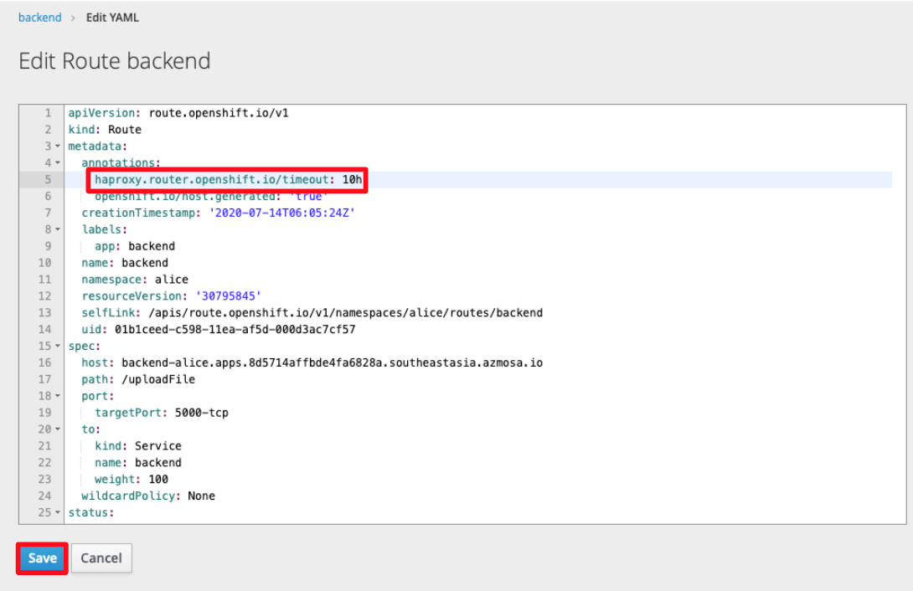
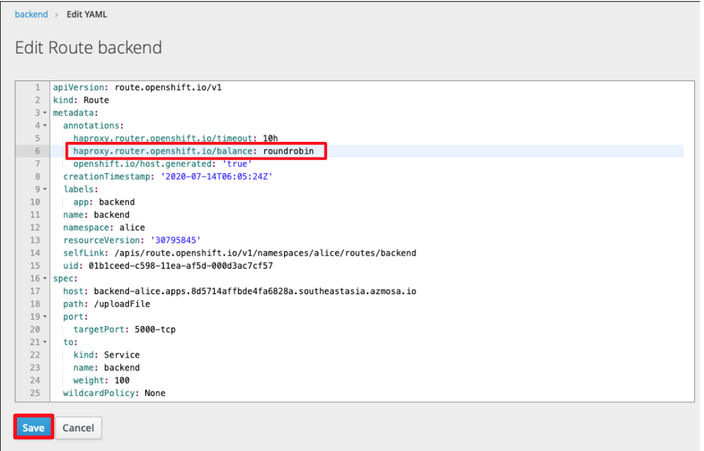

# Openshift RedHat

Red Hat OpenShift is an open source container application platform based on the Kubernetes container orchestrator for enterprise application development and deployment.


## Openshift Terminal 

1. First, copy your login command from the Openshift Web Console
   

2. In your local terminal, paste and run the Openshift Login Command
   

## Creating New Applications

To create a new application that will build, deploy, and run an application from your source code, the steps below will demonstrate how to do so.

1. If your github repo is private, your have to first create a secret key using your github username and password:

   - In the Openshift web console: Resources > Secrets > Create Secret
     

2. In your local terminal, run the `oc new-app` command:

```bash
oc new-app https://github.com/luketankw/ALICE.git#<branch> --source-secret=leekw --strategy=docker --context-dir=backend/AliceBackEnd/TopicModelling --name=topics
```

<github_link>#master specifies the github branch to clone from (if cloning from master, there is no need to specify the branch);
The first argument is the source of the github repo; `--source-secret` is the name of the secret used to access the private github repo; `--strategy` specifies the build strategy (either docker or source); `--context-dir` specifies the file directory of the build path.

3. There was in issue we faced using the web console to create our application.

   - Openshift has multiple ways to create applications. We tried using the [Source to Image (S2I)](openshift.com/blog/create-s2i-builder-image) method (shown below) which generates a new Docker image using source code and a builder Docker image, i.e. `--strategy=source`
   - However, the S2I strategy ignores the `Dockerfile` in the github repo and is why we chose to use the Openshift terminal commands instead of the web console to create our application, i.e. `--strategy=docker`

   

### Codes to build Openshift applications

1. Backend

```bash
oc new-app https://github.com/luketankw/ALICE.git#parallel --source-secret=leekw --strategy=docker --context-dir=backend 
--name=backend
```

&nbsp;2. Frontend

```bash
oc new-app https://github.com/luketankw/ALICE.git --source-secret=leekw 
--strategy=docker --context-dir=frontend 
--name=frontend
```

&nbsp;3. NER

```bash
oc new-app https://github.com/luketankw/ALICE.git#parallel --source-secret=leekw 
--strategy=docker --context-dir=backend/AliceBackEnd/NER 
--name=ner
```

&nbsp;4. Relation

```bash
oc new-app https://github.com/luketankw/ALICE.git --source-secret=leekw 
--strategy=docker --context-dir=backend/AliceBackEnd/Relation 
--name=relation
```

&nbsp;5. Aspect-Based Sentiment Analysis (ABSA)

```bash
oc new-app https://github.com/luketankw/ALICE.git#parallel --source-secret=leekw 
--strategy=docker --context-dir=backend/AliceBackEnd/ABSA 
--name=absa
```

&nbsp;6. Wordcloud Aspect-Based Sentiment Analysis (WCABSA)

```bash
oc new-app https://github.com/luketankw/ALICE.git#parallel --source-secret=leekw 
--strategy=docker --context-dir=backend/AliceBackEnd/WordCloud_ABSA 
--name=wcabsa
```

&nbsp;7. Sentiment

```bash
oc new-app https://github.com/luketankw/ALICE.git --source-secret=leekw 
--strategy=docker --context-dir=backend/AliceBackEnd/Sentiment 
--name=sentiment
```

&nbsp;8. Summary

```bash
oc new-app https://github.com/luketankw/ALICE.git#parallel --source-secret=leekw 
--strategy=docker --context-dir=backend/AliceBackEnd/TextSummarizer 
--name=summary
```

&nbsp;9. Classifier

```bash
oc new-app https://github.com/luketankw/ALICE.git --source-secret=leekw 
--strategy=docker --context-dir=backend/AliceBackEnd/Classifier 
--name=classifier
```

&nbsp;10. Topics

```bash
oc new-app https://github.com/luketankw/ALICE.git --source-secret=leekw 
--strategy=docker --context-dir=backend/AliceBackEnd/TopicModelling 
--name=topics
```

&nbsp;11. Wordcloud

```bash
oc new-app https://github.com/luketankw/ALICE.git --source-secret=leekw 
--strategy=docker --context-dir=backend/AliceBackEnd/WordCloud 
--name=wordcloud
```

&nbsp;12. Clustering

```bash
oc new-app https://github.com/luketankw/ALICE.git --source-secret=leekw 
--strategy=docker --context-dir=backend/AliceBackEnd/Clustering 
--name=clustering
```

&nbsp;13. Documentation

```bash
oc new-app https://github.com/luketankw/ALICE.git --source-secret=leekw 
--strategy=docker --context-dir=alice-documentation 
--name=docs
```

## Routing

1. To create routes within your application: Applications > Routes > Create Route
   

2. When creating routes, you need to take note of the `name`, `path`, and `service` of the route.

- The route will be configured as such: `http://<name>-alice.apps.8d5714affbde4fa6828a.southeastasia.azmosa.io/<path>`
- The service will tell the route which container it is linked to
- From the image below, the route created is linked to the `backend` container and can be accessed at `http://backend-alice.apps.8d5714affbde4fa6828a.southeastasia.azmosa.io/uploadFile`

  

### Routes to create

1. Summary

   - Name: summary
   - Path: /textSummarizer
   - Service: summary
   - Target Port: 5060 -> 5060 (TCP)

2. Sentiment

   - Name: sentiment
   - Path: /sentiment
   - Service: sentiment
   - Target Port: 5050 -> 5050 (TCP)

3. NER

   - Name: ner
   - Path: /ner
   - Service: ner
   - Target Port: 5020 -> 5020 (TCP)

4. Relation

   - Name: relation
   - Path: /relation
   - Service: relation
   - Target Port: 5010 -> 5010 (TCP)

5. Topics

   - Name: topics
   - Path: /topic_modelling
   - Service: topics
   - Target Port: 5040 -> 5040 (TCP)

6. Classifier

   - Name: classifier
   - Path: /classifier
   - Service: classifier
   - Target Port: 5030 -> 5030 (TCP)

7. Wordcloud

   - Name: wordcloud
   - Path: /wordcloud
   - Service: wordcloud
   - Target Port: 5070 -> 5070 (TCP)

8. Clustering

   - Name: clustering
   - Path: /cluster
   - Service: clustering
   - Target Port: 5080 -> 5080 (TCP)

9. Aspect-Based Sentiment Analysis

   - Name: absa
   - Path: /aspectSentiment
   - Service: absa
   - Target Port: 5090 -> 5090 (TCP)

10. Wordcloud Aspect-Based Sentiment Analysis

   - Name: wcabsa
   - Path: /wordCloudABSA
   - Service: wcabsa
   - Target Port: 5100 -> 5100 (TCP)

11. Wordcloud Aspect-Based Sentiment Analysis Overview

   - Name: wcabsaoverview
   - Path: /wcABSAOverview
   - Service: wcabsa
   - Target Port: 5100 -> 5100 (TCP)

12. Backend (updateNetwork)

   - Name: updatenetwork
   - Path: /updateNetwork
   - Service: backend
   - Target Port: 5000 -> 5000 (TCP)

13. Backend (uploadFile)

   - Name: backend
   - Path: /uploadFile
   - Service: backend
   - Target Port: 5000 -> 5000 (TCP)

14. Backend (loadExistingFile)

   - Name: loadexistingfile
   - Path: /loadExistingFile
   - Service: backend
   - Target Port: 5000 -> 5000 (TCP)

15. Backend (loadDbFile)

   - Name: loaddbfile
   - Path: /loadDbFile
   - Service: backend
   - Target Port: 5000 -> 5000 (TCP)

16. Backend (saveToDb)

   - Name: savetodb
   - Path: /saveToDb
   - Service: backend
   - Target Port: 5000 -> 5000 (TCP)

17. Frontend

   - Name: frontend
   - Path: /
   - Service: frontend
   - Target Port: 3000 -> 3000 (TCP)

18. Documentation (mkdocs)

   - Name: docs
   - Path: /
   - Service: docs
   - Target Port: 8000 -> 8000 (TCP)

## Route Timeout

1. Some of our post requests take a relatively long time. To prevent from the connection from encountering a timeout error, we have to adjust the timeout of our routes.
   

2. Applications > Route > `route_name` > Actions > Edit YAML

   

3. In the YAML file, we edit the following property to increase the timeout duration:
   

### Timeouts to set:

&nbsp;1. Classifier 
```bash
oc annotate route classifier  --overwrite haproxy.router.openshift.io/timeout=10h
```

&nbsp;2. ABSA
```bash
oc annotate route absa --overwrite haproxy.router.openshift.io/timeout=10h
```

&nbsp;3. Backend 
```bash
oc annotate route backend  --overwrite haproxy.router.openshift.io/timeout=10h

oc annotate route loaddbfile  --overwrite haproxy.router.openshift.io/timeout=10h 

oc annotate route loadexistingfile  --overwrite haproxy.router.openshift.io/timeout=10h 

oc annotate route savetodb   --overwrite haproxy.router.openshift.io/timeout=10h 

oc annotate route updatenetwork   --overwrite haproxy.router.openshift.io/timeout=10h 
```

&nbsp;4. Clustering 
```bash
oc annotate route clustering  --overwrite haproxy.router.openshift.io/timeout=10h
```

&nbsp;5. Frontend 
```bash
oc annotate route frontend  --overwrite haproxy.router.openshift.io/timeout=10h 
```

&nbsp;6. NER
```bash
oc annotate route ner --overwrite haproxy.router.openshift.io/timeout=10h 
```

&nbsp;7. Relation
```bash
oc annotate route relation --overwrite haproxy.router.openshift.io/timeout=10h 
```

&nbsp;8. Sentiment 
```bash
oc annotate route sentiment  --overwrite haproxy.router.openshift.io/timeout=10h 
```

&nbsp;9. Summary 
```bash
oc annotate route summary --overwrite haproxy.router.openshift.io/timeout=10h 
```

&nbsp;10. Topics
```bash
oc annotate route topics  --overwrite haproxy.router.openshift.io/timeout=10h 
```

&nbsp;11. Wordcloud Aspect-Based Sentiment Analysis 
```bash
oc annotate route wcabsa --overwrite haproxy.router.openshift.io/timeout=10h 

oc annotate route wcabsaoverview  --overwrite haproxy.router.openshift.io/timeout=10h 
```

&nbsp;12. Wordcloud 
```bash
oc annotate route wordcloud  --overwrite haproxy.router.openshift.io/timeout=10h
```

## Auto Scaling

1.  
2.  
3.  
4.  

## Load Balancing

1.  
2.  

### Load-balancing Strategy

- When a route has multiple endpoints, HAProxy distributes requests to the route among the endpoints based on the selected load-balancing strategy. This applies when no persistence information is available, such as on the first request in a session.

- The strategy can be one of the following:

  - `roundrobin`: Each endpoint is used in turn, according to its weight. This is the smoothest and fairest algorithm when the server’s processing time remains equally distributed.

  - `leastconn`: The endpoint with the lowest number of connections receives the request. Round-robin is performed when multiple endpoints have the same lowest number of connections. Use this algorithm when very long sessions are expected, such as LDAP, SQL, TSE, or others. Not intended to be used with protocols that typically use short sessions such as HTTP.

  - `source`: The source IP address is hashed and divided by the total weight of the running servers to designate which server will receive the request. This ensures that the same client IP address will always reach the same server as long as no server goes down or up. If the hash result changes due to the number of running servers changing, many clients will be directed to different servers. This algorithm is generally used with passthrough routes.

## Deleting Applications

To delete an application, run:

```bash
oc delete all --selector app=<app_name>

oc get pods # get a list of all pods
oc delete pod <pod_name> -n <project_name> --grace-period=0 --force # delete any pod related to the application
```

To delete all applications, run:
```bash
oc delete all --all
```