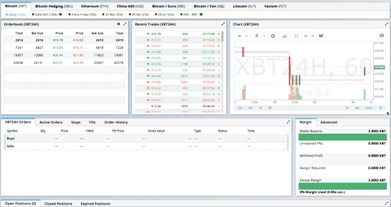

# Visualization

The two data visualization libraries that A.L.I.C.E. uses are [React Force Graph](https://github.com/vasturiano/react-force-graph) and [Nivo](https://nivo.rocks/). Both are built on top of d3 and Reactjs.

We also used other libraries, such as [Material UI](https://material-ui.com/), [Material Table](https://material-table.com/#/), and [React Taggy](https://github.com/johncmunson/react-taggy).

| Component           |                        Visualization Library                         |
| ------------------- | :------------------------------------------------------------------: |
| Document Clustering |         [Nivo Scatterplot](https://nivo.rocks/scatterplot/)          |
| NER Table           |           [Material Table](https://material-table.com/#/)            |
| NER Text            |      [React Taggy](https://github.com/johncmunson/react-taggy)       |
| NER Piechart        |                 [Nivo Pie](https://nivo.rocks/pie/)                  |
| Relation Table      |           [Material Table](https://material-table.com/#/)            |
| Network Graph       | [React Force Graph](https://github.com/vasturiano/react-force-graph) |
| Sentiment Graph     |                 [Nivo Bar](https://nivo.rocks/bar/)                  |
| Topic Bubble        |              [Nivo Bubble](https://nivo.rocks/bubble/)               |

## React Force Graph

We use the components `ForceGraph2D` and `ForceGraph3D`, which are found in `src/components/NetworkGraph/TwoDGraph.js` and `src/components/NetworkGraph/ThreeDGraph.js` respectively.

```js
const TwoDGraph = (props) => {
  const {
    width, // width of the canvas
    height, // height of the canvas
    data, // nodes and links
    selectedNode, // highlights the node if clicked on in the NER table
    selectedLink, // highlights the link if clicked on in the Relation table
    highlightNodes, // set of nodes that are currently highlighted
    setHighlightNodes,
    highlightLinks, // set of links that are currently highlighted
    setHighlightLinks,
    hoverObject, // array that indicates priority of highlight - index 0 is the node id; index 1 is the link; index 2 is the hovered node/link
    setHoverObject,
    showRelationorEntity, // Either '', 'NODE', or 'LINK'
    setShow,
    linkDistance, // Adjusts the distance between two nodes in a link
    chargeStrength, // Adjusts the strength of repulsion between nodes
    cooldownTicks, // How many build-in frames to render before stopping and freezing the layout engine
  } = props;
  const fgRef2D = useRef(null);

  ...

  return (
    <>
      <ForceGraph2D
        ref={fgRef2D}
        ...
      />

      // Displays an information panel at the top right of the graph
      // to indicate the node/link being highlighted
      {!hoverObject.every((element) => element === null) &&
        (hoverObject[2] && typeof hoverObject[2] === 'string' ? (
          <div className="object-details">
            <div>
              <b>Entity</b>:{' '}
              {hoverObject[2].indexOf('_') === -1
                ? hoverObject[2]
                : hoverObject[2].slice(0, hoverObject[2].indexOf('_'))}
            </div>
          </div>
          ...
        ) : null)}
      }
    </>
  )
};
```

## Nivo

We used the Nivo library to visualize sentiment, NER, document clustering, and topic modelling. An example of usage is shown below:

`src/components/NerTable/NerPieChart.js`

```js
import { ResponsivePie } from '@nivo/pie';
...

const NerPieChart = (props) => {
    ...
    return (
        <ResponsivePie
        data={...}
        ...
        />
    )
}
```

## Material Table

[Material Table](https://material-table.com/#/) is a React data table component based on `material-ui`

We use it to display information for our NER and Relation data in `NerTable/NerTable.js`, `OverviewNerTable/OverviewNerTable.js`, `RelationExtraction/OverviewRelationTable.js`, and `RelationExtraction/RelationTable.js`.

The main component that we call in the components above is `layouts/Header/Table/Table.js`:

```js
import MaterialTable from 'material-table';
...

const Table = (props) => {
    ...
    return (
    <MaterialTable
      data={data}
      title={title}
      actions={actions}
      columns={columns}
      icons={tableIcons}
      options={options}
      onRowClick={onRowClick}
      editable={editable}
      tableRef={tableRef}
      detailPanel={detailPanel}
      onSearchChange={onSearchChange}
      onFilterChange={onFilterChange}
    />
    )
}
```

The full list of props can be found [here](https://material-table.com/#/docs/all-props).

## React Taggy

Our entity display component `src/components/NerDisplacy/Taggy.js` is based off [source code](https://github.com/johncmunson/react-taggy/blob/master/src/index.js) from [React Taggy](https://github.com/johncmunson/react-taggy) and spacy's [displaCy](https://explosion.ai/demos/displacy) visualizer.

This visualization tool tags user-defined entities within a block of text.

## React Grid Layout and SizeMe

[`react-grid-layout`](https://github.com/STRML/react-grid-layout) creates a grid layout system, which allows the individual dashboard components to be draggable and resized.

[`react-sizeme`](https://github.com/ctrlplusb/react-sizeme) allows the child components to be aware of their parent components' widths and heights (`react-grid-layout`).



These libraries are implemented in `Dashboard/Dashboard.js` and `Dashboard/OverviewDashboard.js`. An example is shown below:

`Dashboard/Dashboard.js`

```js
import { Responsive, WidthProvider } from 'react-grid-layout';
import { SizeMe } from 'react-sizeme';
...

const ResponsiveGridLayout = WidthProvider(Responsive);
const Dashboard = (props) => {
    ...
    return (
        ...
        <ResponsiveGridLayout
        margin={[10, 10]}
        containerPadding={[20, 20]}
        rowHeight={30}
        className="layout"
        layouts={layout}
        isDraggable={true} // Enables dragging
        isResizable={true} // Enables resizing
        onLayoutChange={(layout, layouts) => onLayoutChange(layout, layouts)} // Allows the layout changes to be remembered and saved to the Redux store
        draggableHandle=".viscard-header" // Sets the draggable area to a particular css class
      >
         <div key="topic-modelling">
          <SizeMe monitorHeight> // monitorHeight introduces the height property to the `size` prop
            {({ size }) => {
              return (
                <VisualCard
                  title="Topic Modelling"
                  category="Key words and topics"
                  content={
                    <div style={{ height: size.height * 0.8, width: '100%' }}> // Component's height and width is dynamic based on parent component
                      <TopicBubble data={topicData} />
                    </div>
                  }
                />
              );
            }}
          </SizeMe>
        </div>
        ...
      </>
    )
}
```
