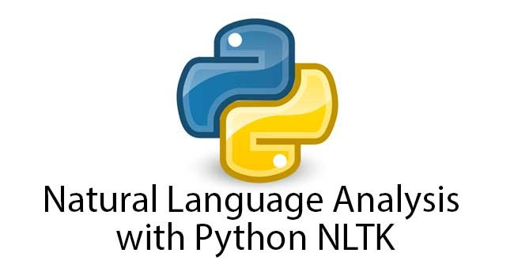

# Wordcloud Aspect-based Sentiment Analysis (WCABSA)

- Positive and negative words surrounding the entity are extracted at sentence, chapter and document level. 
- Extraction is done using SentimentIntensityAnalyzer from Nltk. This model uses lexicon-based sentiment analysis. This means the model makes use of an existing lexicon with words tagged with a positive, negative and neutral score. 
- The positive and negative words with regards to an entity are displayed as a word cloud. Positive words are color-coded green, negative words are color-coded red. 


## Python wordcloud library, Nltk 



`backend/AliceBackEnd/WordCloud_ABSA/app.py`

### Extract Sentiment Words

```python
def extract_sentiment_words(sentence): 

  """
  Args:
  		sentence: string, a sentence 
        
  Returns: 
  		pos_word_list: list of positive words present in the sentence  
        neg_word_list: list of negative words present in the sentence 
  """
  
  tokenized_sentence = nltk.word_tokenize(sentence)

  sid = SentimentIntensityAnalyzer()
  pos_word_list=[]
  neg_word_list=[]

  for word in tokenized_sentence:
      if (sid.polarity_scores(word)['compound']) >= 0.1:
          pos_word_list.append(word)
      if (sid.polarity_scores(word)['compound']) <= -0.1:
          neg_word_list.append(word)    

  return pos_word_list, neg_word_list
```

`def extract_sentiment_words(sentence):` extracts all positive and negative words  present in a sentence\
`def entity_sentimentwords_chapter(l):` extracts all positive and negative words present in a chapter\
`def entity_sentimentwords_document(dc, inc):` extracts all positive and negative words present in a document  
(This function is found in `backend/app.py`)


The output of `def entity_sentimentwords_chapter(l):` and `def entity_sentimentwords_document(dc, inc):` is in the form: 

```python
{
'Malaysian': {
			 'pos': ['focused', 'responsible', 'engagement', 'freedom', 'grants', 'freedom'], 
             'neg': ['critical']
             },
'Kenyon': {
		  'pos': ['focused', 'responsible', 'engagement', 'freedom'],
          'neg': ['critical']
          }, 
...
}
```

### Generate wordcloud 

```python
def wc_green_red(text, pos, neg): 
	
    """
    Args: 
    	 text: string, contains positive and negative words from pos and neg respectively 
         pos: list of positive words
         neg: list of negative words
        
    Returns: 
    	bytestring of word cloud 
    """
    
    # Defines shape of word cloud 
    custom_mask = np.array(Image.open("Book4.jpg"))

    # Generate word cloud 
    wc = WordCloud(collocations=False, background_color = "white", mask = custom_mask).generate(text)
    
    # color_to_words is a mapping of color and words 
    # default color is the color of words that are absent in color_to_words 
    color_to_words = {
        'green': pos, 
        'red': neg, 
        '#80CED7': ['neutral']
    }
    default_color = 'grey'
    grouped_color_func = SimpleGroupedColorFunc(color_to_words, default_color)
    wc.recolor(color_func=grouped_color_func)
    imageRes = wc.to_image()

    # Convert to bytestring 
    file_object = io.BytesIO()
    imageRes.save(file_object, format='PNG')
    bytestring = base64.b64encode(file_object.getvalue())
    result = bytestring.decode('utf-8')

    return result
```
### Routes

The route `/wordCloudABSA`is used to obtain the sentiment wordcloud on the chapter level dashboard.  

```python
@app.route('/wordCloudABSA', methods=['GET', 'POST'])
def wordCloud_ABSA(): 
    try: 
        data = request.json
        sentimentWord_c = entity_sentimentwords_chapter(data)
        key = list(sentimentWord_c.keys())[0]
        pos = sentimentWord_c[key]['pos']
        neg = sentimentWord_c[key]['neg']
        text = ' '.join(pos + neg)
        wc = wc_green_red(text, pos, neg)
        returnJson = {'sentimentWordCloud': wc, 'sentimentWordChapter':sentimentWord_c}
    except Exception as err: 
        print('error in /wordCloudABSA', err, flush=True)
    return returnJson
```
The variable data for the route `/wordCloudABSA` is in the form: 

```python
[
{
'aspect': 'Malaysian',
'sentiment': 'Negative',
'sentences': {
			'Positive': [...],
            'Negative': [
            			'The Media in Malaysia Overview: Ownership, Segmentation, and Regulation Malaysian media have traditionally focused on nation-building, social cohesion, and responsible journalism (Kenyon and Marjoribanks 2007, 104), rather than on, for instance, critical engagement or freedom of information.',
                        'Although Article 10 of the Malaysian constitution grants freedom of expression, a number of specific laws, along with well-entrenched norms, limit that right.', 
                        ...
                        ],
            'Neutral': [...]
            }
},
{
'aspect': 'Kenyon',
'sentiment': 'Positive',
'sentences': {
			 'Positive': [
             			 'The Media in Malaysia Overview: Ownership, Segmentation, and Regulation Malaysian media have traditionally focused on nation-building, social cohesion, and responsible journalism (Kenyon and Marjoribanks 2007, 104), rather than on, for instance, critical engagement or freedom of information.', 
                         ...
                         ], 
             'Negative': [...],
             'Neutral': [...]
             }
}, 
...
]
```

The route `/wordCloudABSA`is used to obtain the sentiment wordcloud on the document level (overview) dashboard.  

```python
@app.route('/wcABSAOverview', methods=['GET', 'POST'])
def wc_ABSA_Overview(): 
    try: 
        data = request.json
        key = list(data.keys())[0]
        pos = data[key]['pos']
        neg = data[key]['neg']
        text = ' '.join(pos + neg)
        wc = wc_green_red(text, pos, neg)
        returnJson = {'sentimentWordCloud': wc}
    except Exception as err: 
        print('error in /wcABSAOverview', err, flush=True)
    return returnJson
```

The variable data for the route `/wcABSAOverview` is in the form: 

```python
{
'Malaysian': {
			 'pos': ['focused', 'responsible', 'engagement', 'freedom', 'grants', 'freedom', 'great', 'fabulous' ], 
             'neg': ['critical', 'worse']
             },
'Kenyon': {
		  'pos': ['focused', 'responsible', 'engagement', 'freedom'],
          'neg': ['critical']
          }, 
...
}
```

### Structure 

###### Interaction between ABSA, frontend and WCABSA 
- To obtain the default sentiment wordcloud on chapter level dashboard, the response from the route `/aspectSentiment`, specifically the key sentimentTableData, is passed to the route `/wordCloudABSA`. 
- To obtain subsequent wordclouds on different entities, frontend can post to the route `/wordCloudABSA`. 
- To obtain the default sentiment wordcloud on document level (overview) dashboard, the output from `def entity_sentimentwords_document(dc, inc):` is passed to the route  `/wcABSAOverview`. 
- To obtain subsequent wordclouds on different entities, frontend can post to the route `/wcABSAOverview`. 
